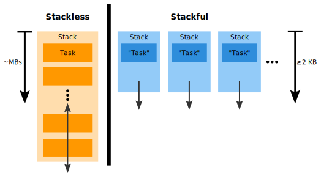

# `$ whoami`

- Alex Povel 👋
- been rusting away for ~2 years
- today, also use Rust at my work at Cloudflare

## Refresher: state of async

- types and concepts for async provided
- but **no runtime**:
  - C#, Python, JavaScript ship with one
  - tokio is popular
  - many others exist
- async ≠ threading

# Why does async exist?

---

- Performance!

  🤏 right-sized tasks

  ⌛️ cheap context switches

  🔮 zero-cost abstractions
- Efficient waiting

## Zero-cost abstractions demanded

  ```rust
  fn main() {
      unsafe { libc::puts("Hello\0".as_ptr() as *const i8) };
  }
  ```

<p class="fragment">
no runtime → no green threads (cf. Cgo)
</p>

## How do we do I/O then?

- ~~green threads~~
- native threads
  - mostly fine, but "limited" scaling
- coroutines
  - `yield`
  - suspend when blocked
  - keep state between suspensions

## coroutines = async = state machines

```rust
async fn greet() {
    println!("Hi!");
    sleep(Duration::from_secs(1)).await;
    println!("Bye!");
}
```

---

returns something like...

```rust
pub trait Future {
    type Output;

    fn poll(self: &mut self) -> Poll<Self::Output>;
}
```

---

where `await` marks a _suspension point_, which is backed by...

```rust
enum GreetFutureStateMachine { // Compiler-provided
    Init,
    // `println!("Hi!");`
    Wait1(SleepFut), // Sleep...
    // `println!("Bye!");`
    Done,
}
```

---

which can be driven forward by `poll`ing...

```rust
impl Future for GreetFutureStateMachine { // Compiler-provided
    type Output = (); // No return value

    fn poll(&mut self) -> Poll<Self::Output> {
      todo!("next slide...");
    }
}
```

---

```rust
fn poll(&mut self) -> Poll<Self::Output> {
    match *self {
        Self::Init => {
            println!("Hi!");
            *self = Self::Wait1(sleep(Duration::from_secs(1)));
            Poll::Pending
        }
        Self::Wait1(sf) => {
            sf.poll()?; // Check if underlying is ready (fake syntax)
            println!("Bye!");
            *self = Self::Done;
            Poll::Ready(())
        }
        Self::Done => panic!("Contract violation"),
    }
}
```

## async & iterators: many parallels

| Goal                 | `Future`     | `Iterator`   |
| -------------------- | ------------ | ------------ |
| Keep state           | in `enum`    | in `struct`  |
| Advance...           | `poll()`     | `next()`     |
| ...not done          | `Pending`    | `Some(T)`    |
| ...done              | `Ready(T)`   | `None`       |
| Intermediate results | **Behavior** | Data `T`     |
| Final result         | Data `T`     | -            |
| Sugarcoat it         | `async fn`   | `gen fn` (?) |

<!-- | Driving it           | Caller       | Caller       | -->

---

<!-- Source: https://github.com/rust-lang/rust/blob/80d0d927d5069b67cc08c0c65b48e7b6e0cdeeb5/compiler/rustc_ast/src/ast.rs#L2614-L2627 -->

Today, compiler already contains:

```rust
pub enum CoroutineKind {
    /// `async`, which returns an `impl Future`.
    Async { span: Span, closure_id: NodeId, return_impl_trait_id: NodeId },
    /// `gen`, which returns an `impl Iterator`.
    Gen { span: Span, closure_id: NodeId, return_impl_trait_id: NodeId },
}
```

# Cheap context switches

- "thread context switching is expensive"
- "switching between tasks is cheap"
- yes, but...
  - OS threads call `read(2)` **once**
  - tasks call `read(2)` **more than once**
    - `EAGAIN`, `epoll(7)`
- I/O bound? Context switch advantage disappears
  - not I/O bound? → CPU bound → async wrong

# Right-sized tasks



## 1 million concurrent tasks: easy!


Copyright [Piotr Kołaczkowski](https://pkolaczk.github.io/memory-consumption-of-async/)

# Conclusion

1. Right-sized tasks: ✅
2. Cheaper context switches: 🤷‍♀️
3. Zero-cost abstractions: 💡

# Thanks!

Thank you for coming to my Ted talk.

[github.com/alexpovel/shining-a-light-on-async-internals](https://github.com/alexpovel/shining-a-light-on-async-internals)


# Further Reading

- _Rediscovering the Future_ [workshop from Conrad Ludgate at EuroRust 2024](https://eurorust.eu/2024/workshops/async-rust/)
- [Asynchronous Programming in Rust: Learn asynchronous programming by building working examples of futures, green threads, and runtimes](https://www.packtpub.com/en-de/product/asynchronous-programming-in-rust-9781805128137?type=print)
- [Rust Once, Run Everywhere](https://blog.rust-lang.org/2015/04/24/Rust-Once-Run-Everywhere.html)
- [Abstraction without overhead: traits in Rust](https://blog.rust-lang.org/2015/05/11/traits.html)
- [Async Rust in Three Parts](https://jacko.io/async_intro.html)

---

- [FFI compilation comparison](https://godbolt.org/z/xWMY6xq8T)
- [Comparison of Rust async and Linux thread context switch time and memory use](https://github.com/jimblandy/context-switch)
- [Remove Runtime RFC](https://github.com/aturon/rfcs/blob/remove-runtime/active/0000-remove-runtime.md)
- [How are coroutines implemented?](https://discuss.python.org/t/how-are-coroutines-implemented/1106/2)
- [How Much Memory Do You Need to Run 1 Million Concurrent Tasks?](https://pkolaczk.github.io/memory-consumption-of-async/)

---

- [Zero-cost futures in Rust](https://aturon.github.io/blog/2016/08/11/futures/)
- [Generators with UnpinCell](https://without.boats/blog/generators-with-unpin-cell/)
- [How Rust optimizes async/await I](https://tmandry.gitlab.io/blog/posts/optimizing-await-1/)
- [Why choose async/await over threads?](https://notgull.net/why-not-threads/)
- [`CoroutineKind`](https://github.com/rust-lang/rust/blob/80d0d927d5069b67cc08c0c65b48e7b6e0cdeeb5/compiler/rustc_ast/src/ast.rs#L2614-L2627)
- [Add support for `gen fn`](https://github.com/rust-lang/rust/pull/118457)
