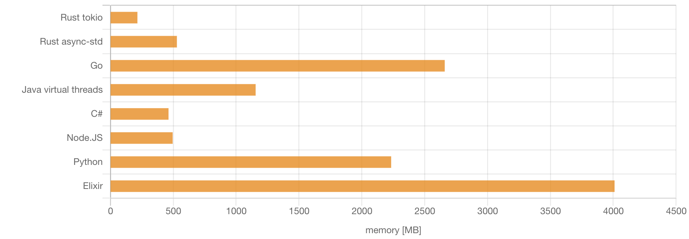

# `$ whoami`

- Alex Povel 👋
- been rusting away for ~2 years
- today, also use Rust at my work at Cloudflare

## Refresher

- Rust provides fundamental types and concepts for async
- but **no runtime**
  - C#, Python, JavaScript ship with one
  - tokio is most popular for Rust
  - many others exist
- the _concept_ of async is independent of threading

# Why does async exist?

- Performance!
  1. **right-sized tasks**: less memory consumption
  2. **cheaper context switches**: tasks cheaper than threads
  3. **zero-cost abstractions**: FFI-friendly + state machines
<!-- - Efficient waiting -->

## Zero-cost abstractions

- Rust favors abstractions at no _additional_ costs
- including FFI:

    ```rust
    fn main() {
        unsafe { libc::puts("Hello\0".as_ptr() as *const i8) };
    }
    ```
- which precludes green threads: cannot afford runtime
  - cf. Cgo with its C-incompatible stack

## How do we do I/O then?

- ~~green threads~~
- native threads
  - mostly fine, but "limited" scaling
- coroutines (`yield` keyword)
  - take turns when blocked
  - keep state in between suspensions

## State machines

```rust
async fn greet() {
    println!("Hi!");
    sleep(Duration::from_secs(1)).await;
    println!("Bye!");
}
```

---

returns something like...

```rust
pub trait Future {
    type Output;

    fn poll(self: &mut self) -> Poll<Self::Output>;
}
```

---

where `await` marks a _suspension point_, which is backed by...

```rust
enum GreetFutureStateMachine { // Compiler-provided
    Init,
    // `println!("Hi!");`
    Wait1(SleepFut /* `sleep(Duration::from_secs(1))` */),
    // `println!("Bye!")`;
    Done,
}
```

which can be driven forward by `poll`ing...

---

```rust
impl Future for GreetFutureStateMachine { // Compiler-provided
    type Output = (); // No return value

    fn poll(&mut self) -> Poll<Self::Output> {
      todo!("next slide...");
    }
}
```

---

```rust
fn poll(&mut self) -> Poll<Self::Output> {
    match *self {
        Self::Init => {
            println!("Hi!");
            *self = Self::Wait1(sleep(Duration::from_secs(1)));
            Poll::Pending
        }
        Self::Wait1(sf) => {
            sf.poll()?; // Check if underlying is ready (fake syntax)
            println!("Bye!");
            *self = Self::Done;
            Poll::Ready(())
        }
        Self::Done => panic!("Contract violation"),
    }
}
```

## Quacks like iterators...

| Goal                 | `Future`     | `Iterator`  |
| -------------------- | ------------ | ----------- |
| Keep state           | in `enum`    | in `struct` |
| Advance...           | `poll()`     | `next()`    |
| ...not done          | `Pending`    | `Some(T)`   |
| ...done              | `Ready(T)`   | `None`      |
| Intermediate results | **Behavior** | Data `T`    |
| Final result         | Data `T`     | -           |
| Driven by            | Caller       | Caller      |

# Fewer context switches

- "native thread context switches are expensive"
- "user-space switches between tasks are cheap"
- ⚠️ except:
  - native threads call `read(2)` only **once**, then block
  - tasks call `read(2)` **multiple times** (`EAGAIN`, `epoll(7)`)
- 👉 when I/O bound, context switch advantage disappears
  - when not I/O bound, we're CPU bound, where async is wrong choice anyway

# Right-sized tasks

- `GreetFutureStateMachine`: *exactly* as much state as required as they're *stackless*
  - vs. *stackful* coroutines (e.g. Goroutines ≥ 2 KB)
- usual drop semantics

---

Spawning 1 million tasks (sleep 10)



Copyright [Piotr Kołaczkowski](https://pkolaczk.github.io/memory-consumption-of-async/)

# Summary

1. Right-sized tasks: ✅
2. Cheaper context switches: 🤷‍♀️
3. Zero-cost FFI: 💡

# Thanks!

Thank you for coming to my Ted talk.

[github.com/alexpovel/shining-a-light-on-async-internals](https://github.com/alexpovel/shining-a-light-on-async-internals)


# Further Reading

- _Rediscovering the Future_ [workshop from Conrad Ludgate at EuroRust 2024](https://eurorust.eu/2024/workshops/async-rust/)
- [Asynchronous Programming in Rust: Learn asynchronous programming by building working examples of futures, green threads, and runtimes](https://www.packtpub.com/en-de/product/asynchronous-programming-in-rust-9781805128137?type=print)
- [Rust Once, Run Everywhere](https://blog.rust-lang.org/2015/04/24/Rust-Once-Run-Everywhere.html)
- [Abstraction without overhead: traits in Rust](https://blog.rust-lang.org/2015/05/11/traits.html)
- [Async Rust in Three Parts](https://jacko.io/async_intro.html)

---

- [FFI compilation comparison](https://godbolt.org/z/xWMY6xq8T)
- [Comparison of Rust async and Linux thread context switch time and memory use](https://github.com/jimblandy/context-switch)
- [Remove Runtime RFC](https://github.com/aturon/rfcs/blob/remove-runtime/active/0000-remove-runtime.md)
- [How are coroutines implemented?](https://discuss.python.org/t/how-are-coroutines-implemented/1106/2)
- [How Much Memory Do You Need to Run 1 Million Concurrent Tasks?](https://pkolaczk.github.io/memory-consumption-of-async/)

---

- [Zero-cost futures in Rust](https://aturon.github.io/blog/2016/08/11/futures/)
- [Generators with UnpinCell](https://without.boats/blog/generators-with-unpin-cell/)
- [How Rust optimizes async/await I](https://tmandry.gitlab.io/blog/posts/optimizing-await-1/)
- [Why choose async/await over threads?](https://notgull.net/why-not-threads/)
